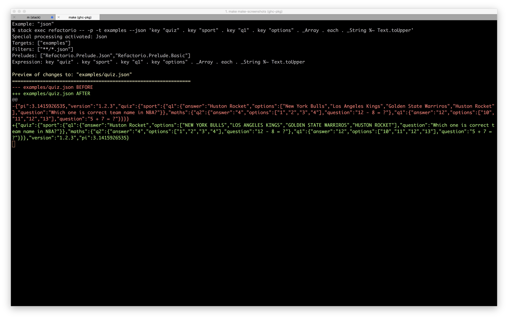
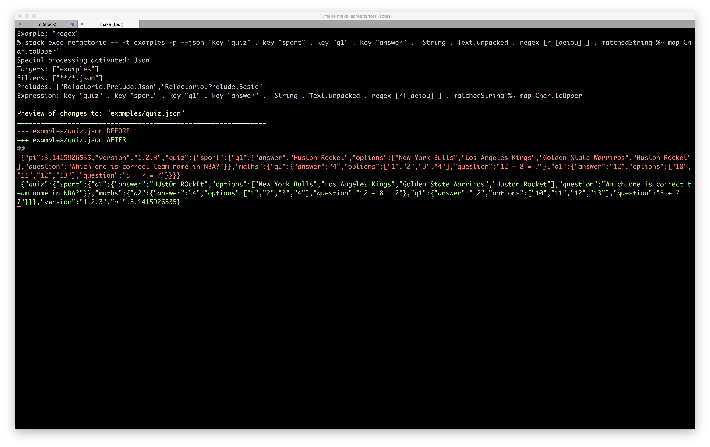

# refactorio

** PLEASE BE AWARE THIS IS ALPHA SOFTWARE AND NOT ONLY WILL THE API CHANGE BUT
IT WILL PROBABLY EAT YOUR CHILDREN.  YOU HAVE BEEN WARNED. **

Lens based Haskell refactoring toolkit.

> Study after study shows that the very best designers produce structures that
> are faster, smaller, simpler, clearer, and produced with less effort. The
> differences between the great and the average approach an order of magnitude.
>
> - Fred Brooks

## Usage

    Refactorio - Optical Refactoring Tool

    Usage: refactorio [--io] EXPR [-t|--target TARGET] [-g|--glob GLOB]
                      [--prelude MODULE] ([-a|--ask] | [-p|--preview] |
                      [-m|--modify] | [--review] | [-s|--search]) [--examples]
                      [--haskell|--hs] [--html] [--json] [--xml] [--yaml]

    Available options:
      --io                     Add IO to expr type ('ByteString -> IO ByteString')
      EXPR                     A Haskell expression of type 'ByteString ->
                               ByteString'
      -t,--target TARGET       A file/directory to traverse (default: ".")
      -g,--glob GLOB           Glob matches to include (eg '*.ini', 'f??b?r.c')
      --prelude MODULE         Use a specific Prelude module
      -a,--ask                 Ask before changing files (default)
      -p,--preview             Only show the changes that would be made
      -m,--modify              Make the changes and summarize changed filenames
      --review                 Make the changes and show details of changes
      -s,--search              Activate alternate search mode (Haskell mode only
                               right now)
      --examples               Temporary mode for creating examples
      --haskell,--hs           Include .hs files and make Haskell ops available
      --html                   Include .htm(l) files and make XML ops available
      --json                   Include .json files and make JSON ops available
      --xml                    Include .xml files and make XML ops available
      --yaml                   Include .y(a)ml files and make YAML ops available
      -h,--help                Show this help text

## Major Modes

In all modes Refactorio traverses one or more files executing a `ByteString ->
ByteString` function on them.  For a given file if the function does not change
the input then no output is logged for that file.  If the function does change
the file then what happens next is dependent on the mode.

Any `ByteString -> ByteString` function definition will work, for example:

    BS.reverse

    BS.take 1024

    over convert Text.toUpper

    # or equivalently
    convert %~ Text.toUpper

    key "foo" . _Number *~ 3

### Ask Mode (-a / --ask)

This is the default mode.  In this mode Refactorio will show you the changes
that it's about to make and prompt you on a file by file basis whether you want
to accept the changes or not.  If you accept, the file will be replaced, if not
the file will be left intact (or you can 'Q'uit at any time).

### Preview Mode (-p / --preview)

not touch any files.  You can think of it sort of like a `--dry-run`.
In this mode Refactorio will just show all the changes that it would make, but

### Review Mode (-r / --review)

In this mode Refactorio will make changes to all files without asking but will
show the full set of changes as they are made.

### Modify Mode (-m / --modify)

This is basically a `--quiet` style mode that makes all changes without
confirmation and just reports which files changed with no further details.

### Search Mode (-s / --search)

This is a special mode which currently only works with
`haskell-src-exts(-prisms)` which provide `SrcSpanInfo`s which represent the
portion of the source code that a given feature occupies.  This mode can be
easily made to work with any other lenses that can provide access to similar
information and we are exploring ways to broaden it's usefulness further.

## Examples

Here are a few examples to whet your appetite.  For more see
[examples](examples/).

### JSON (via [lens-aeson](https://hackage.haskell.org/package/lens-aeson)):

"Increment the value at key 'baz' by 1962."

### YAML (same operators):

"Multiply the value of the key 'baz' by 10."

### HTML (via [xml-html-conduit-lens](https://hackage.haskell.org/package/xml-html-conduit-lens))

    TODO: Find a good way to deal with HTML.  (problems with each of `hexpat-lens`, `hexml-lens`, `xml-html-conduit-lens` and `xml-lens`)

### XML (also via [xml-html-conduit-lens](https://hackage.haskell.org/package/xml-html-conduit-lens))

C'mon, you've never needed to "find all the authors with names longer than 15
characters and then sort all of the letters in their name that are above 'm' in
place?" Pshaw.

### Regex (via [lens-regex](https://hackage.haskell.org/package/lens-regex)):

Drop regex's in anywhere you like, eg. "uppercase and reverse the characters in
the value of the JSON object at this key that match this regular expression":

### Compressed Files (via [zlib-lens](https://hackage.haskell.org/package/zlib-lens)):

Reach inside eg. gzipped files and do what you gotta do:

<!--  -->

Example is temporarily unavailable, but goes something like:

    refio -t foo.json.gz --json 'convert . from Z.gzipped . from convert . key \"baz\" . _Number *~ 85'

<!-- (Not sure what's up with that "trailing garbage.") -->

### Type Conversions

The beginnings of `convert` and `convertTo/convertFrom` (along with `a`/`an`)
exist which can be used like so:

When types can be infered:

    % refio --html -t /tmp/voltron/src 'convert %~ Text.toUpper'

When types have to be clarified:

    % refio --html -t /tmp/voltron/src 'convertTo(a::LByteString).xml...name %~ Text.toUpper'

### Haskell (via [haskell-src-exts](https://hackage.haskell.org/package/haskell-src-exts) and [haskell-src-exts-prisms](https://hackage.haskell.org/package/haskell-src-exts-prisms)):

TODO: revamp after re-wiring

Try these on your projects:

    refio --haskell _Module.biplate._ModuleName.end
    refio --haskell _Module.biplate._Int.end
    refio --haskell _Module.biplate._String.end
    refio --haskell _Module.biplate._FieldUpdate.end
    refio --haskell _Module.biplate._Frac.end
    refio --haskell '_Module.biplate._Int.filtered(odd.view target).end'
    refio --haskell '_Module.biplate._Int.filtered(even.view target).end'
    refio --haskell '_Module.biplate._Int.filtered((>10).view target).end'

There are [more examples here](examples/).

## Pro-Tip

For now the easiest way to get it working is build it with `stack build` and then:

    alias refio="stack exec refactorio --"

and run it from the refactorio project root to get an experience something
like:

    refio --json 'key "foo" . key "bar" . _Number *~ 15' -t ./examples

or

    refio -s --haskell _Module.biplate._ModuleName.end

(where the `-t`/`--target` is a file or directory to process and can be outside
of the refactorio project root).

## Warnings

In addition to the general warning about this being alpha quality software, no
work has been done on performance and in fact in some cases even reasonable
performance has been sacrificed in the name of expediency.

In some places I've resorted to outright hacks, such as when parsing YAML by
reading it as YAML, writing it as JSON for processing it with `lens-aeson`,
then converting it back.

In addition to being slow some of these tricks will do things like cause a file
to be reformatted by the serialization round-trip even if your function doesn't
make an actual semantic change.

## Configurable Format-specific Preludes

Refactorio has a hardcoded set of qualified imports which you can find
[somewhere around
here](https://github.com/SuperpowersCorp/refactorio/blob/master/src/X/Language/Haskell/Interpreter.hs#L30).

Currently the only unqualified import that Refactorio mandates is
`Text.Regex.Quote` which brings the `r` QuasiQuoter into scope.

In addition Refactorio attempts to load a single "Prelude" which can bring
unqualified names into scope.  Various lens packages for different formats have
conflicting imports (eg. _String in `lens-aeson` and in
`haskell-src-exts-prisms`) so to avoid conflicts for now if you pass a "special
mode" flag (eg. `--haskell`, `--json`, etc) Refactorio will attempt to use
`Refactorio.Prelude.{ModeName}` (eg `Refactorio.Prelude.Haskell`, etc).  If no
special mode is provided, `Refactorio.Prelude.Basic` is used.
