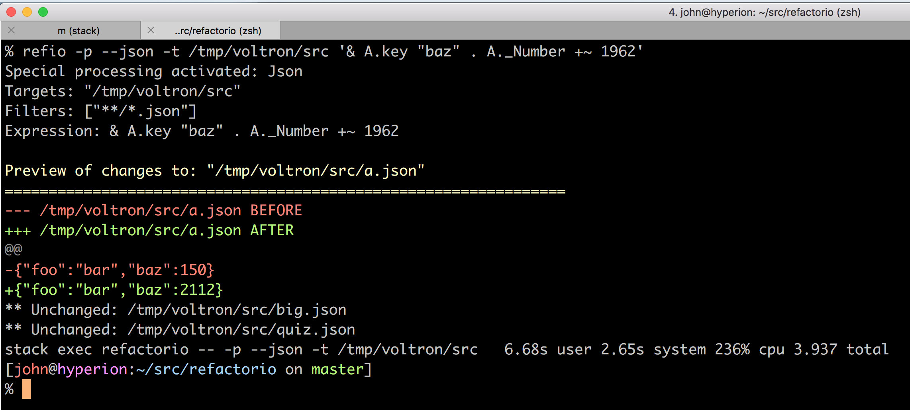
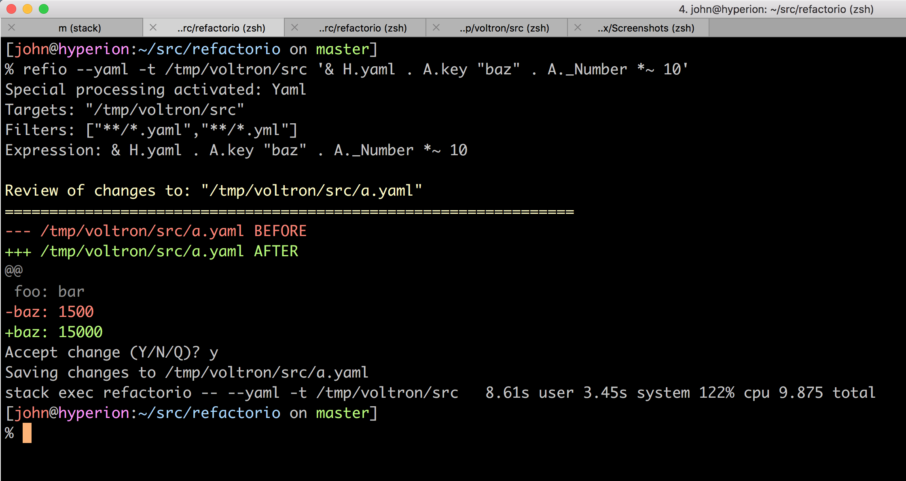
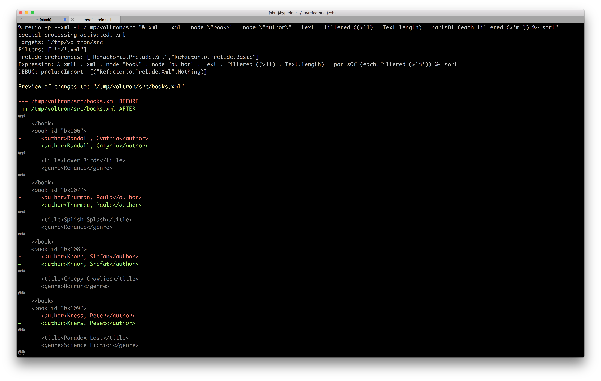
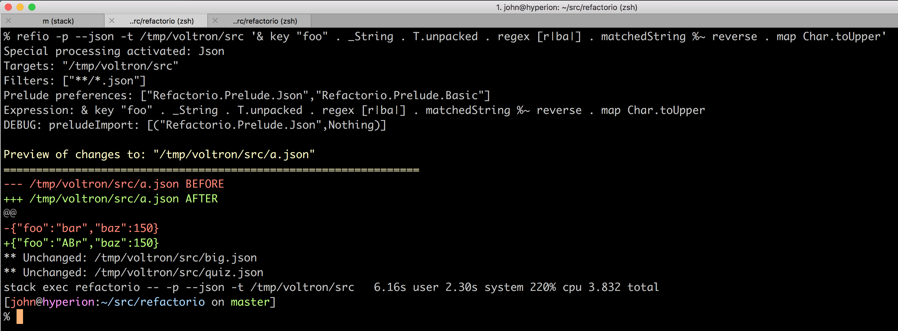
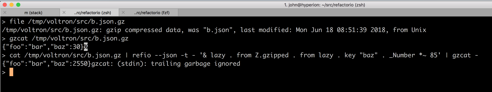

# refactorio

** PLEASE BE AWARE THIS IS ALPHA SOFTWARE AND NOT ONLY WILL THE API CHANGE BUT
IT WILL PROBABLY EAT YOUR CHILDREN.  YOU HAVE BEEN WARNED. **

Lens based Haskell refactoring toolkit.

> Study after study shows that the very best designers produce structures that
> are faster, smaller, simpler, clearer, and produced with less effort. The
> differences between the great and the average approach an order of magnitude.
>
> - Fred Brooks

## Usage

Refactorio - Optical Refactoring Tool

    Usage: refactorio EXPR [-t|--target TARGET] [-g|--glob GLOB] [--prelude MODULE]
                      ([-a|--ask] | [-p|--preview] | [-r|--review] | [-m|--modify])
                      [--haskell|--hs] [--html] [--json] [--xml] [--yaml]
      Zen and the art of optical file maintenance.

    Available options:
      EXPR                     ByteString -> ByteString
      -t,--target TARGET       A file/directory to search/replace (default: ".")
      -g,--glob GLOB           Glob matches to include (eg '*.ini', 'f??b?r.c')
      --prelude MODULE         Use a specific Prelude module
      -a,--ask                 Ask before changing files (default)
      -p,--preview             Only show the changes that would be made
      -r,--review              Make the changes and show details of changes
      -m,--modify              Make the changes and summarize changed filenames
      --haskell,--hs           Include .hs files and make Haskell ops available
      --html                   Include .htm(l) files and make XML ops available
      --json                   Include .json files and make JSON ops available
      --xml                    Include .xml files and make XML ops available
      --yaml                   Include .y(a)ml files and make YAML ops available
      -h,--help                Show this help text

## Major Modes

In all modes Refactorio traverses one or more files executing a `ByteString
-> ByteString` function on them.  For a given file if the function does not
change the input then no output is logged for that file.  If the function does
change the file then what happens next is dependent on the mode.

Any `ByteString -> ByteString` function definition will work, for example:

    BS.reverse

    BS.take 1024

    over convert Text.toUpper

There is a shortcut for using `&` style lens application in point-free style.
The last `over` example can be written as:

    & convert %~ Text.toUpper

which allows the use of the wider range of operators, eg.

    & key "foo" . _Number *~ 3
    & key "foo" . _Number +~ 10
    etc

### Ask Mode (-a / --ask)

This is the default mode.  In this mode Refactorio will show you the changes
that it's about to make and prompt you on a file by file basis whether you want
to accept the changes or not.  If you accept, the file will be replaced, if not
the file will be left intact (or you can 'Q'uit at any time).

### Preview Mode (-p / --preview)

In this mode Refactorio will just show all the changes that it would make, but
not touch any files.  You can think of it sort of like a `--dry-run`.

### Review Mode (-r / --review)

In this mode Refactorio will make changes to all files without asking but will
show the full set of changes as they are made.

### Modify Mode (-m / --modify)

This is basically a `--quiet` style mode that makes all changes without
confirmation and just reports which files changed with no further details.

## Examples

Here are a few examples to whet your appetite.  For more see [examples](examples/).

### JSON (via [lens-aeson](https://hackage.haskell.org/package/lens-aeson)):

"Increment the value at key 'baz' by 1962."

### YAML (same operators):

"Multiply the value of the key 'baz' by 10."

### HTML (via [xml-html-conduit-lens](https://hackage.haskell.org/package/xml-html-conduit-lens))

    HTML example coming soon.

### XML (also via [xml-html-conduit-lens](https://hackage.haskell.org/package/xml-html-conduit-lens))

C'mon, you've never needed to "find all the authors with names longer than 15
characters and then sort all of the letters in their name that are above 'm' in
place?" Pshaw.

### Regex (via [lens-regex](https://hackage.haskell.org/package/lens-regex)):

Drop regex's in anywhere you like, eg. "uppercase and reverse the characters in
the value of the JSON object at this key that match this regular expression":

### Compressed Files (via [zlib-lens](https://hackage.haskell.org/package/zlib-lens)):

Reach inside eg. gzipped files and do what you gotta do:

(Not sure what's up with that "trailing garbage.")

### Type Conversions

The beginnings of `convert` and `convertTo` exist which can be used like so:

When types can be infered:

    % refio --html -t /tmp/voltron/src '& convert %~ Text.toUpper'

When types have to be clarified:

    % refio --html -t /tmp/voltron/src '& convertTo(a::LByteString).xml...name %~ Text.toUpper'

### Haskell (via [haskell-src-exts](https://hackage.haskell.org/package/haskell-src-exts) and [haskell-src-exts-prisms](https://hackage.haskell.org/package/haskell-src-exts-prisms)):

TODO: revamp after re-wiring

Try these on your projects:

    refio --haskell _Module.biplate._ModuleName.end
    refio --haskell _Module.biplate._Int.end
    refio --haskell _Module.biplate._String.end
    refio --haskell _Module.biplate._FieldUpdate.end
    refio --haskell _Module.biplate._Frac.end
    refio --haskell '_Module.biplate._Int.filtered(odd.view target).end'
    refio --haskell '_Module.biplate._Int.filtered(even.view target).end'
    refio --haskell '_Module.biplate._Int.filtered((>10).view target).end'

There are [more examples here](examples/).

## Pro-Tip

For now the easiest way to get it working is build it with `stack build` and then:

    alias refio="stack exec refactorio --"

and run it from the refactorio project root to get an experience something like:

    refio --json '& key "foo" . key "bar" . _Number *~ 15' -t ../voltron/test/fixtures

or

    refio --haskell _Module.biplate._ModuleName.end -t ../voltron/src

(where the `-t`/`--target` is a file or directory to process and can be outside
of the refactorio project root).

## Warnings

In addition to the general warning about this being alpha quality software, no
work has been done on performance and in fact in some cases even reasonable
performance has been sacrificed in the name of expediency.

In some places I've resorted to outright hacks, such as when parsing YAML by
reading it as YAML, writing it as JSON for processing it with `lens-aeson`,
then converting it back.

In addition to being slow some of these tricks will do things like cause a file
to be reformatted by the serialization round-trip even if your function doesn't
make an actual semantic change.

## Configurable Format-specific Preludes

Refactorio has a hardcoded set of qualified imports which you can find
[somewhere around
here](https://github.com/SuperpowersCorp/refactorio/blob/master/src/X/Language/Haskell/Interpreter.hs#L30)
or if you have a working Refactorio install you can see live via:

    TODO: refio --haskell something...

Currently the only unqualified import that Refactorio mandates is
`Text.Regex.Quote` which brings the `r` QuasiQuoter into scope.

In addition Refactorio attempts to load a single "Prelude" which can bring
unqualified names into scope.  Various lens packages for different formats have
conflicting imports (eg. _String in `lens-aeson` and in
`haskell-src-exts-prisms`) so to avoid conflicts for now if you pass a "special
mode" flag (eg. `--haskell`, `--json`, etc) Refactorio will attempt to use
`Refactorio.Prelude.{ModeName}` (eg `Refactorio.Prelude.Haskell`, etc).  If no
special mode is provided, `Refactorio.Prelude.Basic` is used.

(TODO: clarify above)

## TODOs

- [ ] Allow parenthesizing '& ...' expressions
- [ ] Examples
  - [ ] Replace strictify/etc with documentation/examples of appropriate existing lenses
  - [ ] Automate screenshots
  - [ ] Formulate everthing in terms of appropriate starting Prisms
  - [ ] Embiggen/embetter existing examples to make it more clear whats going on
  - [ ] More
    - [ ] Using preview to construct new elements
    - [ ] stdin
    - [ ] Side effects
    - [ ] Multiple sets/maps (eg "& foo .~ 5 & bar .~ 6" etc)
      eg `% cat /tmp/b.json | refio --json -t - 'over (key "baz" . _Number) (+3) .  over (key "foo" . _String) (Text.reverse . Text.toUpper)'`
- [ ] Special mode pre/post adapter fns
- [ ] Multiple targets
  - [ ] Bail if multiple targets with stdin
- [ ] Bail if modes are provided with stdin ('-') processing
- [ ] Seek guidance from the pros on
  - [ ] CT/lenses
  - [ ] Cool lens tricks that might be applicable
- [ ] Fully restore `haskell-src-exts` functionality.
- [ ] Pandoc lens support for:
  - [ ] Docx
  - [ ] Markdown
  - [ ] others
- [ ] Line Numbers
- [ ] Context lines
- [ ] Sort out issue with `Control.Lens` not being available in installed executable
- [ ] Eliminate unnecessary serialization round trips
  - [ ] eg when processing YAML via JSON
  - [ ] don't changes files when all that changed was formatting.
- [ ] Figure out which existing haskell function `concatStreams` can be reduced to.
- [ ] 1.0 release somewhere around here
- [ ] More granular patch acceptance/rejectance
- [ ] Use mueval so that shared lenses can be used safely.
- [ ] Emacs integration
- [ ] Can we cache generated lenses somehow?
- [ ] Allow Traversals for extraction of arbitrary info.
- [ ] Brick TUI with:
  - [ ] Keep files in memory across edits
  - [ ] Preview / review / selective application
  - [ ] Undo
  - [ ] Fetch/store/share lenses via:
    - [ ] GitHub/gist?
    - [ ] anything else?
- [ ] Better Themes
- [ ] Better Banner Image
- [ ] Approach Factorio people about permission to use a (better version of) the logo
- [ ] `fileplate` to let you treat multiple files as a single unit and do
      `biplate` type stuff to them as a whole?
