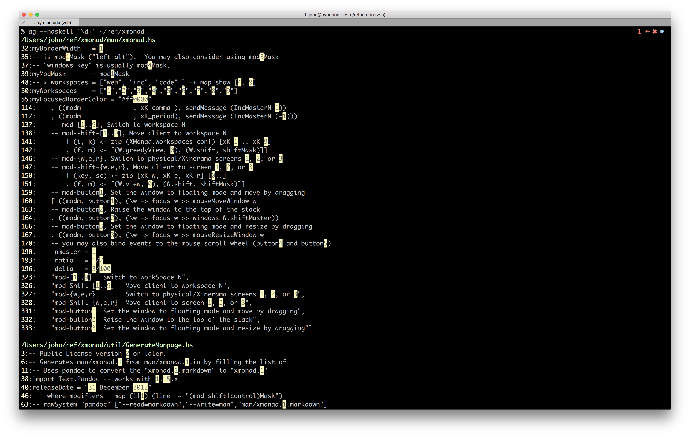
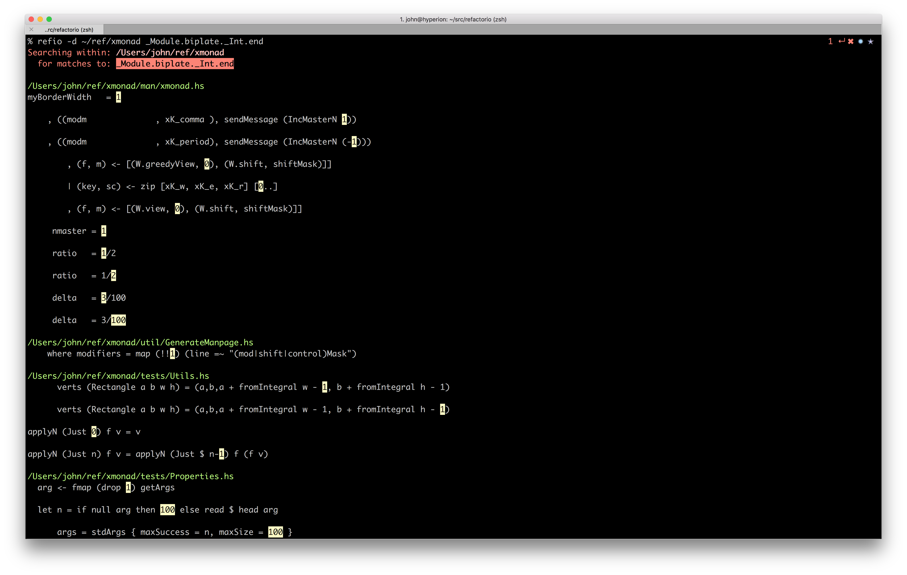
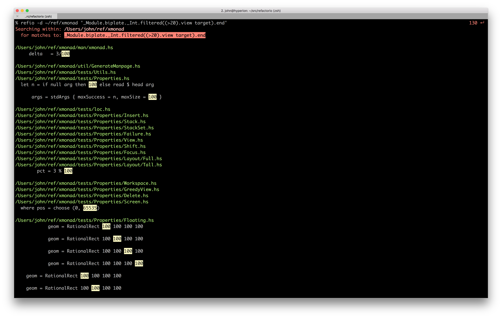
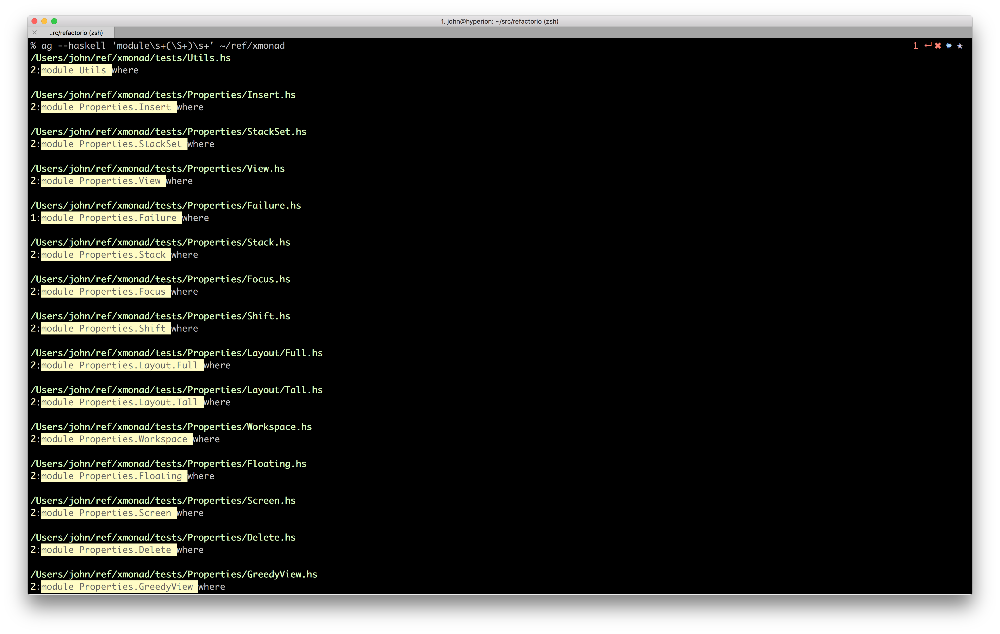
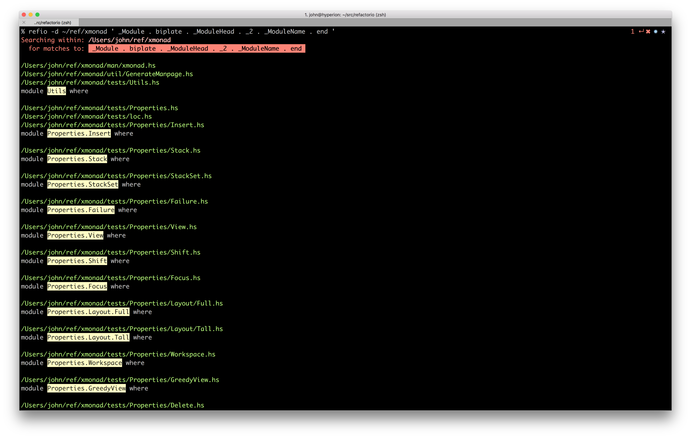
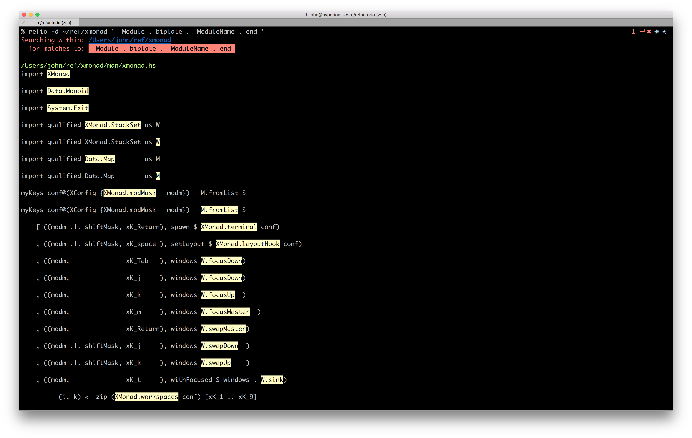

# Refactorio Examples

First of all let me say that I love `ag` and use it all the time.  Nothing in
this document should be construed as a criticism of `ag` or anything else.
However, I have tried to create some examples that, while contrived, are pretty
similar to things that have come up in my day to day experience and where my
otherwise fantastic tools like `ag` have let me down.

While any of the ag examples could be improved upon with various refinements
that would solve one or more of the problems described here, as you can see, in
comparison Refactorio lets you specify exactly what you want with a minimum of
muss and fuss (assuming you are comfortable with lenses).

## Integer Constants

If you wanted to find all of the integer constants in your code, you might try
something like the following with `ag`:

As you can see, you get the occasional `Int` (eg that `nmaster = 1`) but you
also get numbers that appear in strings, numbers that appear in comments,
numbers that appear in identifiers, floats, etc.

With Refactorio:

As you can see, it's not perfect*, but it's a lot better.

*The main problem evidenced by this screenshot is that it picks up for example
those `ratio = 1/2`'s because `1` and `2` are both integer constants that get
`fromInteger 1` and `fromInteger 2`'d at compile time. Unfortunately I think
this is unavoidable without a lot more work.

With Refactorio you can take things a step further and filter to only the
numbers that are greater than, say, 20:

## Module Names

Let's say you wanted to find all of the module names declared in your project.
You might try something like this with `ag`:

This actually works pretty well in this example, but of course code in the real
world might have the module name on a separate line, or the `where` may be on
the next line, so there is no whitespace after the module name or you might
have a string that matches that pattern inside a string somewhere in the code.

Again, you could work around some of these issues, eg by anchoring `module` to
the beginning of the line to avoid the string issue, but with Refactorio all of
those issues are avoided:

Ok, since `ag` did pretty well on that one the results aren't that much
better... so let's kick it up a notch... let's try to find every place in the
codebase where a module name is used at all -- not just where they are
declared.

With ag you might... uhm... well, let me know if you have an idea.

In the meantime, with Refactorio:

