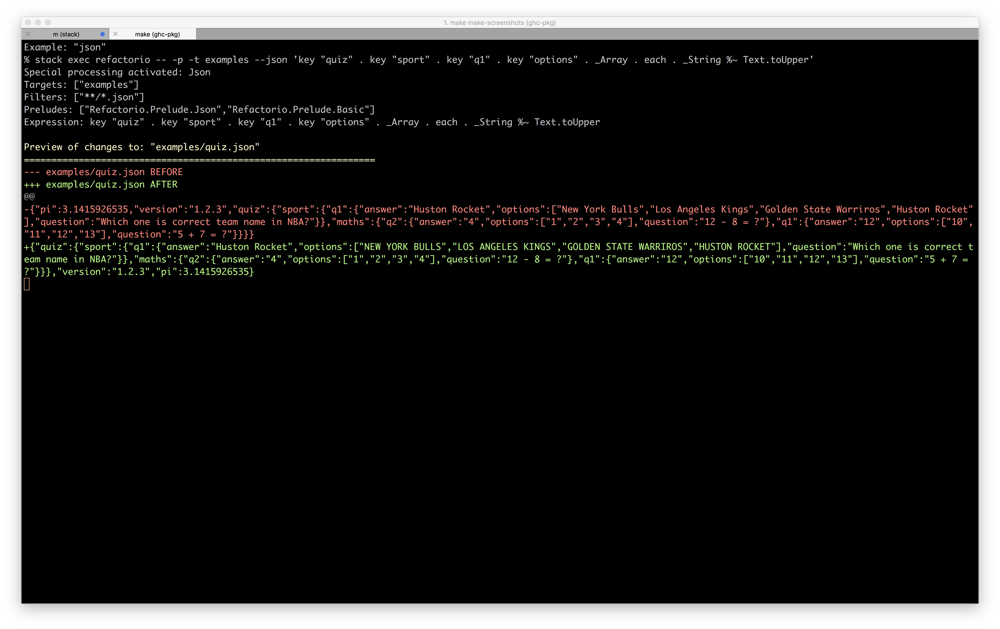
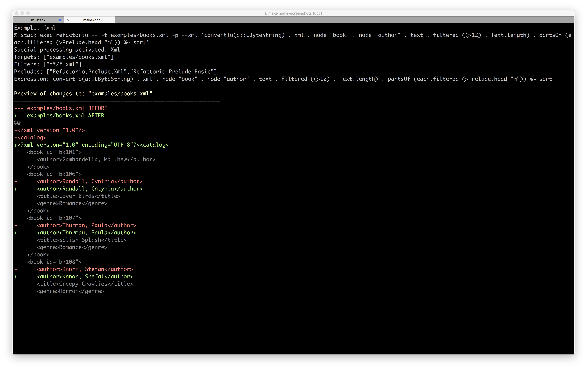

Refactorio Examples
===================

help
----

Current help output at screenshot generation time

json
----

Increment the value at key 'baz' by 1962.

xml
---

C'mon, you've never needed to "find all the authors with names longer
than 15 characters and then sort all of the letters in their name that
are above 'm' in place?" Pshaw.

regex
-----

Drop regex's in anywhere you like, eg. "uppercase and reverse the
characters in the value of the JSON object at this key that match this
regular expression":

composing-multiple-edits
------------------------

NB. in this example the JSON is roundtripped through the serialization
process twice

hs-ints
-------

hs-modname
----------

hs-string
---------

hs-fieldupdate
--------------

hs-frac
-------

hs-odd-ints
-----------

hs-ints-gt-10
-------------

json-review-string
------------------

