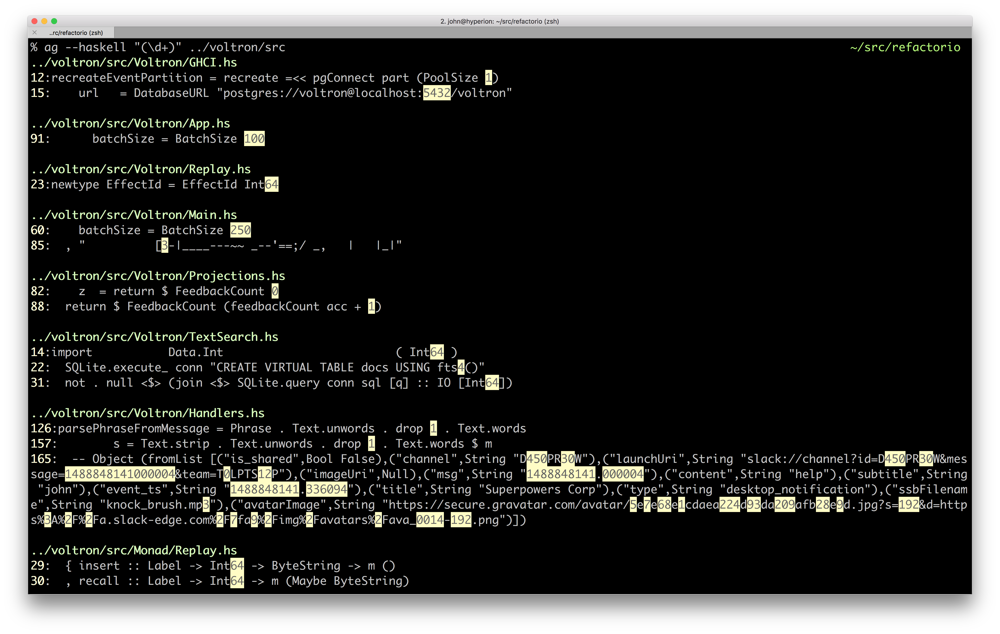
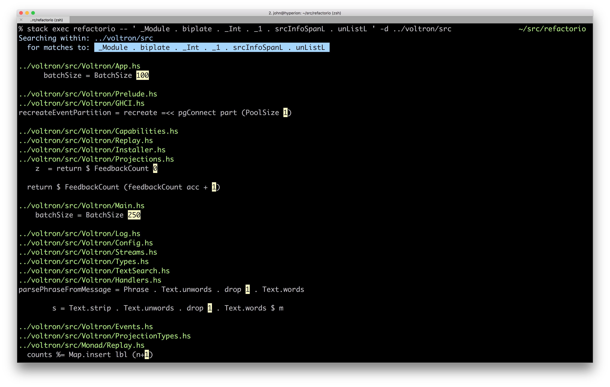
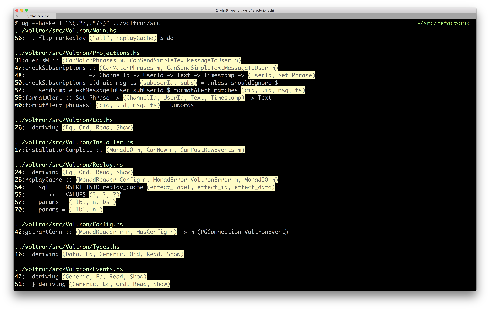
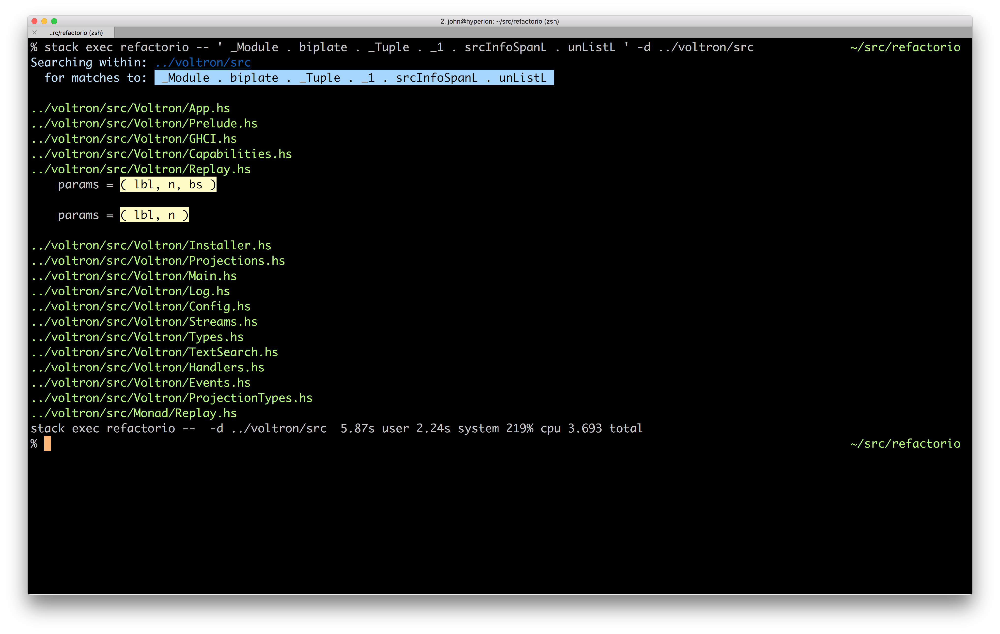

# Refactorio Examples

First of all let me say that I love silver searcher and use it all the time.
Nothing in this document should be construed as a criticism of silver searcher
or anything else, but I've contrived some examples that are pretty similar to
things that come up in my day to day experience.

Many of the ag examples could be improved upon with various refinements that
would solve one or more of the problems illustrated herein, but as you can see,
in comparison Refactorio lets you specify exactly what you want.

Without further adieu...

## Ints

Silver Searcher:

Refactorio:

## Tuples

Silver Searcher:

Refactorio:

## Declared Module Names

Silver Searcher:

[TODO]

Refactorio:

[TODO]
